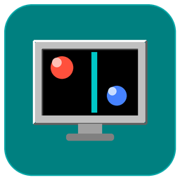

<div align="center">



# JezzBall for VS Code

**Play the classic Windows 95 game JezzBall right inside your editor's side bar.**

[](LICENSE)
[](https://code.visualstudio.com/)
[](CONTRIBUTING.md)

</div>

---

Trap bouncing balls behind walls you draw, claim **75%** of the play field, and clear
the level — all without leaving VS Code. The game is a single, self-contained HTML file
rendered in a webview, styled to look like the real Win95 original.

<!-- Add a screenshot of the game and uncomment the line below:

-->

## Features

- 🎯 Faithful JezzBall gameplay in a side-bar webview
- 🪟 Pixel-perfect Windows 95 chrome (title bar, bevels, teal desktop)
- ⌨️ Keyboard + mouse controls, pause, and mute
- 📐 Auto-fits to whatever width you give the panel
- 🧩 Zero runtime dependencies — the whole game is one HTML file

## Install

### From a packaged `.vsix`

1. Download the latest `jezzball-1.0.0.vsix` from the
   [Releases page](https://github.com/YOUR_GITHUB_USERNAME/jezzball-vscode/releases)
   (or build it yourself — see below).
2. In VS Code open the **Extensions** view → `…` menu → **Install from VSIX…** → pick the file.
3. Run **JezzBall: Play** from the Command Palette, or press <kbd>Ctrl/Cmd</kbd> + <kbd>Alt</kbd> + <kbd>J</kbd>.

### From source (development)

```bash
git clone https://github.com/YOUR_GITHUB_USERNAME/jezzball-vscode.git
cd jezzball-vscode
code .
```

Then press <kbd>F5</kbd>. A second window — the *Extension Development Host* — opens.
In that window run **JezzBall: Play** (or the keybinding above). No build step or
`npm install` is required to run it this way.

### Build your own `.vsix`

```bash
npm run package           # uses npx @vscode/vsce, no global install needed
# → produces jezzball-1.0.0.vsix
```

## Controls

| Action | Key / Mouse |
| --- | --- |
| Grow a wall in both directions | **Left-click** |
| Flip wall direction (vertical ↔ horizontal) | **Right-click** or **Space** |
| Pause | **P** |
| Mute | **M** |
| Clear the level | Capture **75%** of the field |

## Editing the game

The entire game lives in one file: [`media/jezzball.html`](media/jezzball.html).
Tweak it, then reload the webview (close and re-run **JezzBall: Play**, or reload the
Extension Development Host window) to see your changes.

## Publishing to the Marketplace

This repo is wired up to publish, but a few one-time steps are needed:

1. Create a publisher at <https://marketplace.visualstudio.com/manage> and set the
   `"publisher"` field in [`package.json`](package.json) to its ID (currently `local`,
   which only works for local installs).
2. Replace every `YOUR_GITHUB_USERNAME` placeholder with your GitHub handle.
3. Create a **Personal Access Token** (Azure DevOps) and either run
   `npm run publish` locally or add it as the `VSCE_PAT` secret so the
   [release workflow](.github/workflows/release.yml) publishes automatically when you
   push a `v*` tag.

See the official guide:
<https://code.visualstudio.com/api/working-with-extensions/publishing-extension>.

## Contributing

Issues and pull requests are welcome — see [CONTRIBUTING.md](CONTRIBUTING.md).

## License

[MIT](LICENSE) © JezzBall for VS Code contributors.

> JezzBall is a trademark of its respective owner. This is an unofficial, fan-made
> tribute and is not affiliated with or endorsed by Microsoft.
